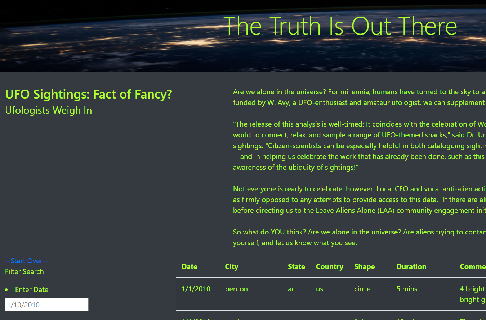
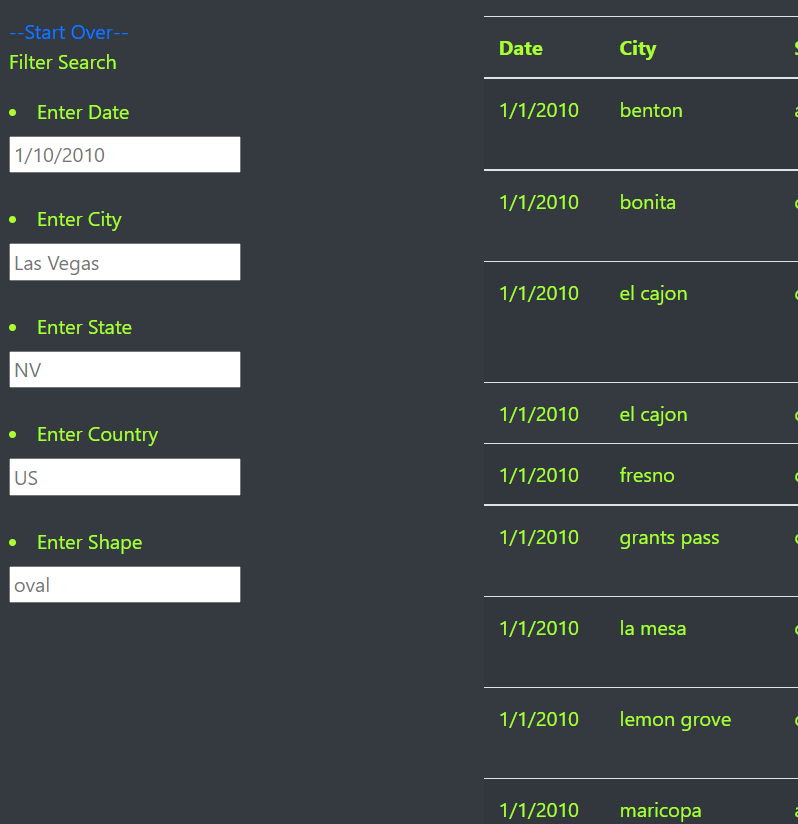
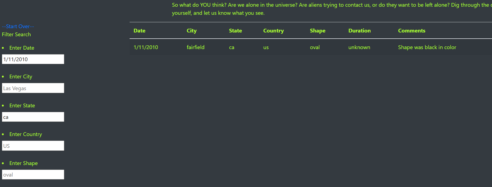

# UFOs Project Summary

This challenge was create a webpage with interactivity so that users could get a more in-depth analysis into the data by simply changing the input requirements.  The information provided was regarding a snipit of approximately 1000 UFO sightings during January 2010.

### Required Deliverables for this Challenge

1. Filter UFO Sightings on multiple criteria
2. Provide a written report on the UFO analysis

The initial setup of this webpage is nicely laid out.  The ease of use, the asthetics of the font, the color scheme are all very important in keeping the user engaged and on the site to discover more.  When taking a look at the entire page from top to bottom, it's a simple-looking sophisticated site, with some input areas to get a deeper dive into the data.  See Figure1.

#### Figure1

From the provided data structure, the 'ask' was to create and enhance the input areas for the user.  The initial code only had the 'date' search capability.  As you can see in Figure2, the filtered search criteria has now expanded to include 'city', 'state', 'country' and 'shape'.  The structure seems quite simple and easy-to-use however, the code behind it is a bit complex.

#### Figure2

The functions and data objects were created in JavaScript, the background colors and font were in CSS code, and the Index and page structure were created in HTML code.  Each script harmoniously balance each other, providing different tasks, put together and displayed in any web browser.

### Results

With the time alloted to complete this project, the functionality works, it's a clean modern-looking feel and vibe.  I chose the yellowgreen color for the font to liven up the page.  The white font with a dark background seemed a bit drab and the yellowgreen gives it a more alien-esque feel.  The entry fields have clear examples of what the expected input should look like so training on the site should be minimal.

--How to perform a search--: 
    enter information in one or more fields of the filter search
        example - under 'Enter Data', type '1/11/2010' then, under 'Enter State', type 'CA' and hit 'Enter' on your keyboard.  See Figure3

#### Figure3

### Summary

The page works as intended and is functional and will be submitted as this was specifically created per user request.  However, I've noticed a clear drawback from this site... there isn't enough data.  The data provided is just a small sample of many many sightings, and one would be easily removed from this site if they're not able to get more information.  UFOs are a very interesting topic and having links to descriptions, scrapings from other UFO sites on topics would make it more interactive and fun.

A couple of other recommendations on further development
    - It may help if there was a 'clear data' button on top of the search criteria.  I've added a '--Start Over--' link so that the page basically refreshes, but with a bit more research, this functionality can be useful.
    - People like to look at images or pictures.  So adding an additional column for images, or linking in some added visuals may help stimulate more visitor traffic.